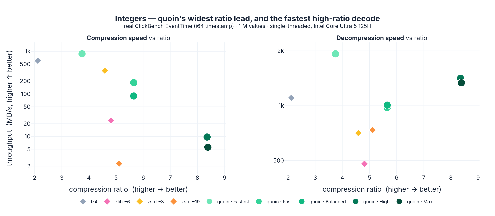
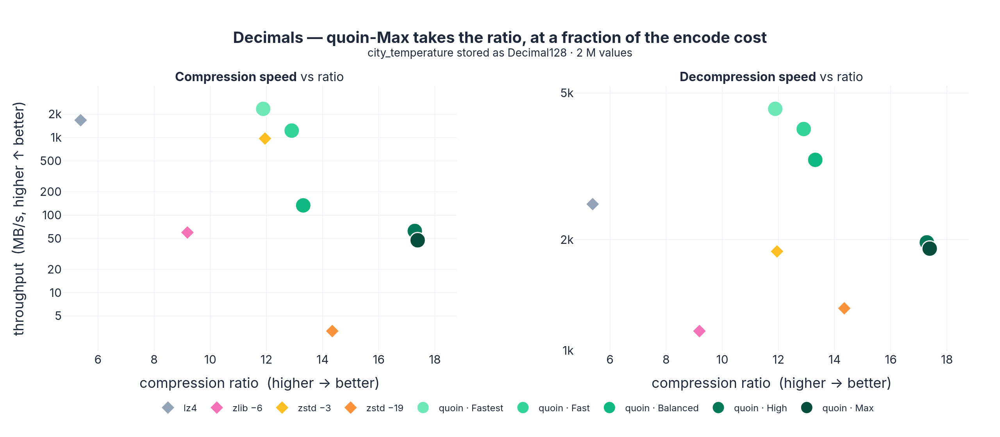
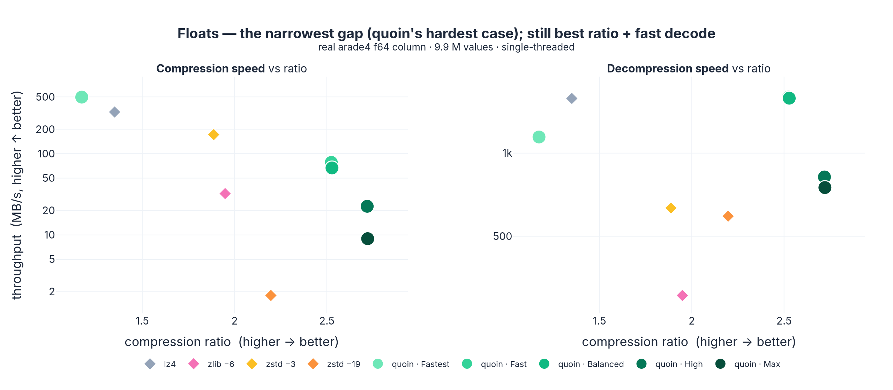
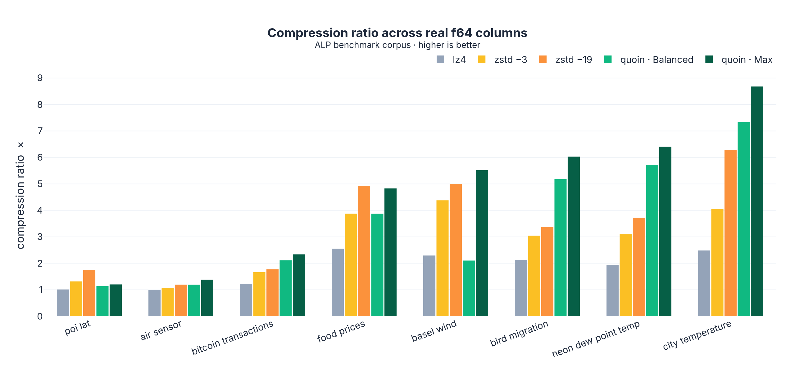
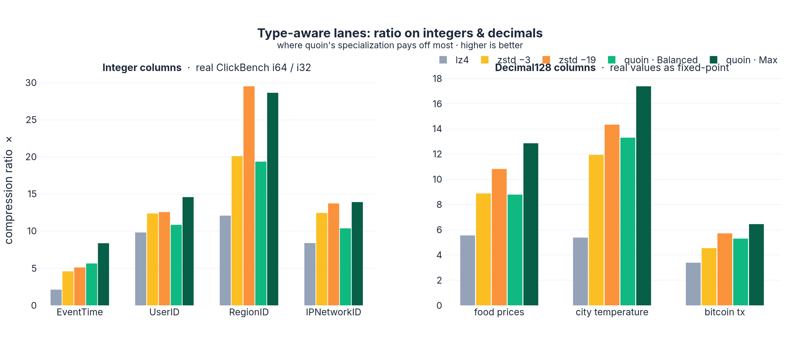

# quoin

📖 [Русская версия](README.ru.md)

**A lossless, type-aware compressor for columns of numbers — written in mostly
safe Rust, built on the Apache Arrow data model.**

(The only `unsafe` in quoin's own code is two small, documented blocks: the CRC32C
hardware intrinsic in `hash.rs` and a bounds-check elision in the range coder's
hot loop — every SIMD kernel also has a bit-exact safe fallback. The vendored
`pco` backend uses more internal `unsafe` for its fast bit-reader.)

quoin compresses columns of `f64`/`f32`/`i64`/`u64`/`i32`/`u32`/decimal (with
null/validity bitmaps) by running a **per-block competition** of lightweight,
type-specialized codecs and emitting the smallest result. Because it knows the
column's *type*, it reaches for the right tool — frame-of-reference + bit-packing
and delta cascades for integers, ALP / ALP-RD and a numeric latent backend for
floats and decimals — instead of treating every column as an opaque byte stream
the way a general LZ compressor does.

The payoff (single-threaded, see [Benchmarks](#benchmarks)): on real f64 columns
quoin typically lands a **better compression ratio than `zstd -19` while
compressing ~30× faster and decompressing 2–5× faster than zstd/zlib**. Its win is
ratio + decode speed; encode is a deliberate level tradeoff (the per-block codec
search is CPU-heavy, so fast LZ codecs out-encode it at a far worse ratio).

```rust
use quoin::{compress, decompress, Config};

let data: Vec<f64> = (0..10_000).map(|i| i as f64 * 0.5).collect();
let packed = compress(&data, Config::default());
let restored = decompress(&packed).unwrap();
assert_eq!(data, restored);
```

## Inspired by

quoin started as a from-scratch, safe-Rust port of the
[`fc`](https://github.com/xtellect/fc) floating-point compressor (Apache-2.0,
© Praveen Vaddadi) and grew into a type-aware columnar engine. It borrows ideas
from the best of the modern columnar-compression literature:

- **[`fc`](https://github.com/xtellect/fc)** — the original FCM/DFCM predictor +
  XOR-residual design quoin was seeded from (the mode IDs still match).
- **ALP** (*Adaptive Lossless floating-Point*, Afroozeh et al., CWI) — the
  scaled-integer and "real-double" (ALP-RD) schemes for doubles that are really
  decimals.
- **BtrBlocks / Vortex** — the per-block "cascade of cheap encodings, pick the
  winner" philosophy, and the goal of staying *decodable fast*.
- **[pcodec / pco](https://github.com/mwlon/pcodec)** — vendored (`vendor/quoin-pco`)
  as the top-tier numeric backend: latent decomposition + bin-packing + ANS.
- **FastLanes** — the transposed 1024-lane bit-packing layout that autovectorizes.
- **Parquet / ClickHouse** — the encodings (`DELTA_BINARY_PACKED`, dictionary,
  RLE) and the block-at-a-time storage model.

## Type-aware compression

Most byte-oriented compressors (zstd, lz4, zlib) see a column of doubles as a
flat blob and hunt for repeated byte strings. quoin instead lowers each typed
column onto a physical **lane** and lets type-appropriate codecs compete:

| Input type | Lane | Notes |
| --- | --- | --- |
| `f64` / `i64` / `u64` | 64-bit | **zero-copy** reinterpret to the `u64` lane |
| `i32` / `u32` / `f32` | widened | sign/zero-extended or exact-widened, narrowed back on decode |
| `Decimal128` / `Decimal256` | 128 / 256-bit | dedicated decimal container (precision/scale preserved) |

Knowing the family (`Float` vs `Int`) gates which codecs even enter the
competition: ALP / ALP-RD / float-multiplier only run on float lanes;
frame-of-reference and the signed-delta cascade specialize on integers. For each
block, every eligible codec is scored by `payload_size + λ·decode_cost` and the
smallest wins (`λ = 0` at the top levels → pure ratio; higher λ at fast levels
biases toward cheap-to-decode modes).

### Codecs in the competition

20 block modes plus three entropy-coder options. Highlights:

- **Integers:** `ForBitpack` (frame-of-reference + FastLanes bit-packing),
  `DeltaBitpack` (Parquet `DELTA_BINARY_PACKED`), `OrderedDelta` (2nd-order
  zig-zag), `Dict` (low-cardinality), `Rle`.
- **Floats / decimals:** `Alp`, `AlpRd`, `FloatMult` (values that are integer
  multiples of `1/scale`), `Delta2` (2nd-order float extrapolation).
- **Predictors:** `Pred` / `Pred2` / `PredRc` (FCM/DFCM hash predictors with XOR
  residuals), `DeltaDp`.
- **Generic:** `Const`, `Stride`, `Xorz`, `ByteTranspose` (AoS→SoA byte planes),
  `Lz`, and the verbatim `Raw` baseline every mode must beat.
- **Numeric backend:** `Pco` (vendored pcodec) at the `High`/`Max` levels.
- **Entropy coders:** an adaptive order-1 **range coder** (best ratio), a 4-way
  interleaved **rANS** (much faster decode), and an **LZ-over-residual** cascade
  (`Max` only).

## How it works — algorithms & optimizations

### The block pipeline

A column is split into independent **blocks**. Each block is compressed on its
own — its own winning codec, its own entropy coder — which is what makes encode
and decode embarrassingly parallel (one rayon task per block) and gives
random-access at block granularity. Block size is **adaptive** (a ~256 KiB base
that grows toward ~1 MiB when the data looks low-entropy, so cheap columns pay
less framing overhead) or pinned via `Config.block_size` to line up with your
storage chunks.

The on-wire frame is just `[mode byte | payload]` per block; an unknown mode is a
hard decode error, never a silent zero-fill.

### Lanes & zero-copy lowering

Every typed column is lowered to a single physical **lane** the codec engine
operates on — almost always a `u64` lane:

- `f64` / `i64` / `u64` → **reinterpreted to `u64` with zero copies** (a bit-cast
  of the slice, no allocation, no byte shuffling).
- `i32` is sign-extended, `u32` zero-extended, `f32` exact-widened to `f64` then
  bit-cast — and narrowed back losslessly on decode.
- Decimals ride a dedicated 128/256-bit container that preserves precision/scale.

Working in one lane width means the integer codecs (FoR, delta, bit-pack) are
written once and apply to *every* integer-family type. Floats are XOR/predictor
material in their raw bit-pattern; "floats that are really decimals" get caught
by the float-value codecs below.

### Frame-of-reference + FastLanes bit-packing

The integer workhorse (`ForBitpack`). For each 1024-value sub-block it subtracts
the block minimum (frame of reference), computes the bit-width of the residual
range, and **bit-packs** to exactly that many bits per value. The packing uses the
**FastLanes** transposed 1024-lane layout: values are interleaved across lanes so
the unpack is a straight-line, branch-free, autovectorizable shift-and-mask —
no per-value branching. `DeltaBitpack` runs the same machinery on first-order
deltas (Parquet's `DELTA_BINARY_PACKED`) for monotone/clustered columns.

### Delta cascades & predictors

- **Ordered deltas** (`OrderedDelta`, `Delta2`): first/second-order differences
  turn ramps and smooth signals into small residuals; zig-zag maps signed deltas
  to small unsigned ints before entropy coding.
- **FCM / DFCM predictors** (`Pred`, `Pred2`, `PredRc`): a finite-context-model
  hash predicts the next value from recent history; only the **XOR residual**
  between prediction and actual is stored, which collapses to near-zero on
  predictable streams. The hash uses a hardware CRC32 instruction where available.
- **`DeltaDp`**: second-order linear prediction in float space, storing the exact
  float residual — and the encoder *verifies* the reconstruction is bit-identical
  before choosing it, so "lossless" is a guarantee, not a hope.

### ALP & ALP-RD for floating point

Real-world doubles are often decimals in disguise (prices, temperatures, sensor
readings). **ALP** detects the common decimal exponent, multiplies values into
integers, and hands those to FoR+bit-packing — with a side list of *exceptions*
for the few values that don't fit, so it's robust to outliers. **ALP-RD**
("real double") handles the harder case by splitting each double into a small
dictionary of high bits plus bit-packed low bits. Together they're why quoin
crushes columns like `city_temperature` (8.7×) that byte-LZ can only nibble at.

### Entropy coding

Residuals from any stage are squeezed by one of three back-ends, chosen by level:

- **Range coder** — bit-serial, adaptive order-1 byte model. Best ratio, but
  ~8 model updates per byte, so it's the slow/high-ratio option.
- **rANS** — table-driven ANS run as **four interleaved chains**, so independent
  table lookups keep the CPU's execution ports busy and decode is far faster than
  the range coder at a small ratio cost. This is the default at `Balanced`.
- **LZ-over-residual cascade** (`Max` only) — when residuals *still* contain
  repeats, an LZ77 pass runs over them before entropy coding, stacking
  dictionary-style gains on top of the numeric model.

### The cost-aware selector — the "smart" part

The competition isn't "try everything blindly." A few optimizations keep it both
small *and* fast:

- **Decode-cost-weighted scoring.** Each candidate is scored
  `payload_size + (λ · decode_weight · decoded_bytes) >> 8`. With `λ = 0` (High/Max)
  the smallest output always wins; at faster levels a non-zero `λ` and a
  per-mode `decode_weight` table bias the choice toward modes that are cheap to
  *decode*, so you can buy decode speed by spending a little ratio — explicitly,
  per level.
- **Early-out for incompressible blocks.** Before running the pool, a block
  that's already high-distinct with full-width value *and* delta ranges is
  recognized as hopeless and emitted as `Raw` immediately — no wasted codec trials.
- **Level-gated pool.** Expensive, non-vectorizable modes (sequential predictors,
  the LZ cascade, the pco backend) only enter the competition at the levels that
  ask for them, so `Fastest`/`Balanced` stay genuinely fast.
- **Optional sampling selector** (`Selection::Sample`): instead of fully encoding
  every candidate, it can score them on a representative sample of the block and
  commit only the winner — trading a sliver of ratio for a big encode speedup.

### The pco numeric backend

At `High`/`Max`, the vendored **pcodec** (`Pco` mode) joins the competition for
numeric columns: it decomposes values into latent streams, bin-packs them, and
ANS-codes the result — frequently the ratio winner on smooth numeric data. Its
three vectorizable decode leaves are `multiversion`-compiled (see below), so it
decodes fast even on a stock build.

## Apache Arrow integration & advantages over Parquet

With `--features arrow`, quoin compresses and reconstructs Arrow arrays directly:

```rust
use quoin::arrow::{compress_array, decompress_array};

let packed = compress_array(&array, Config::default())?;   // &dyn Array -> Vec<u8>
let restored = decompress_array(&packed)?;                  // -> ArrayRef
```

It accepts `Float64/32`, `Int64/32`, `UInt64/32`, and `Decimal128/256` arrays,
reads values **zero-copy** from the Arrow buffers, and round-trips the Arrow
validity (null) bitmap — which is the same LSB-first layout quoin uses
internally, so there is no transcoding at the boundary. A typed, Arrow-native
**C ABI** (`capi/`) exposes the same path to non-Rust callers, decoding straight
into a caller-provided buffer (alignment-safe, with a zero-copy fast path when
the input is aligned).

How that compares to **Parquet** as a compression layer:

- **Type-specialized, not generic.** Parquet's heavy lifting is usually a generic
  zstd/snappy pass over byte pages; quoin's per-block codec competition is chosen
  *by type*, so smooth/periodic/decimal columns compress better (see benchmarks).
- **Much faster decode.** quoin decodes multiple GB/s — it competes on the
  *decode Pareto frontier*, not just ratio.
- **Block-granular & configurable.** A fixed `Config.block_size` aligns
  compression blocks to your storage chunks for independent, parallel,
  random-access decode — without Parquet's row-group/page-header overhead.
- **Stays in the Arrow model.** No row-group metadata, schema envelope, or
  file-format ceremony — it's a column-buffer codec you can drop into an
  Arrow-native store.

## Benchmarks

Measured on an Intel Core Ultra 5 125H, stable Rust release build (no
`target-cpu=native`), **single-threaded** — quoin built **without the `parallel`
feature** (no rayon) and pinned to one P-core (`taskset -c 0`), so it's measured
apples-to-apples against the single-threaded `lz4`/`zlib`/`zstd` bulk APIs. (quoin's
default build *is* block-parallel; that just isn't a fair thing to put on the same
axis as a single-threaded baseline.) Integer columns are real `i64`/`i32` from the
ClickBench `hits` dataset; float columns are the **ALP benchmark corpus**; decimal
columns are real f64 values stored as fixed-point `Decimal128`. Ratio = original ÷
compressed (higher is better); throughput in MB/s of *uncompressed* data (median of
3 trials). Reproduce with:

```bash
# f64 (ALP corpus) — single-threaded, no rayon
taskset -c 0 cargo run --release --no-default-features --example bench_readme \
    --features bench-zstd,bench-lz4,bench-deflate > bench.csv
# integers (ClickBench parquet) + Decimal128
PARQUET_FILE=datasets/parquet/clickbench_hits_0.parquet \
taskset -c 0 cargo run --release --no-default-features --example bench_typed \
    --features bench-parquet,bench-zstd,bench-lz4,bench-deflate > typed.csv
```

### The ratio ⇄ speed tradeoff, per data type

All numbers are **single-threaded** (one P-core, no rayon) so quoin and the
single-threaded `lz4`/`zlib`/`zstd` are measured apples-to-apples. Each codec is
one point — **top-right is best** (high ratio, high throughput) — compression speed
on the left, decompression on the right. The charts are ordered by quoin's ratio
lead: **integers and decimals first** (where the specialized lanes pull furthest
ahead), **floats last** (quoin's hardest case).

Two honest takeaways across all three types:

- **Decode is quoin's frontier.** quoin holds the best ratio *and* a decode speed
  at or above the baselines — the quoin levels trace the top-right edge of the
  decompress panel (Fastest = fastest decode, Max = highest ratio, both still quick).
- **Encode is a deliberate tradeoff.** The per-block codec *search* costs CPU, so
  quoin's high-ratio levels encode slower than fast `lz4`/`zstd -3` (which buy that
  speed with a far worse ratio). quoin still encodes **10–40× faster than `zstd -19`
  at a better ratio**, and the level knob (Fastest→Max) lets you trade encode speed
  for ratio explicitly.

**Integers** — quoin-Max reaches 8.4× (vs `zstd -19`'s 5.1×) and decodes faster than
every baseline; on encode it's slower than `zstd -3` but still ~3× faster than
`zstd -19` at a much higher ratio:



**Decimals** — quoin-Max takes the best ratio (17.4× vs `zstd -19`'s 14.3×);
quoin-Balanced gets 13.3× at **40 MB/s** encode versus `zstd -19`'s 14.3× at
**3 MB/s** (~13× faster), and the quoin levels own the decode panel:



**Floats** — the narrowest gap (mantissa bits are high-entropy): quoin-Balanced
beats `zstd -19`'s ratio (2.53 vs 2.20) and decodes **~2.7× faster**; here the fast
`lz4`/`zstd -3` do encode faster (at 1.35–1.89× ratio), so floats are where quoin's
encode-search cost is most visible:



Numbers behind the float plot (the full 9.9 M-value `arade4` column; the right-hand
columns truncate the same data to show ratio is size-stable):

| codec | ratio | compress MB/s | decompress MB/s | ratio @100 K | ratio @1 M |
| --- | ---: | ---: | ---: | ---: | ---: |
| quoin (Fastest) | 1.17 | **496** | 1144 | 1.18 | 1.17 |
| quoin (Fast) | 2.52 | 78 | **1594** | 2.47 | 2.51 |
| **quoin (Balanced)** | **2.53** | 67 | 1580 | 2.55 | 2.52 |
| quoin (High) | 2.72 | 22 | 820 | 2.72 | 2.71 |
| **quoin (Max)** | **2.72** | 9 | 750 | 2.72 | 2.71 |
| lz4 | 1.35 | 326 | 1577 | 1.32 | 1.34 |
| zlib -6 | 1.95 | 32 | 305 | 1.91 | 1.94 |
| zstd -3 | 1.89 | 172 | 633 | 1.86 | 1.88 |
| zstd -19 | 2.20 | 2.4 | 591 | 2.17 | 2.19 |

### Ratio across real columns

Across the ALP corpus, quoin-Max takes the best ratio on 6 of 8 columns (sorted
left→right by quoin's ratio below):



| dataset | n | lz4 | zlib -6 | zstd -3 | zstd -19 | quoin-Bal | quoin-Max |
| --- | ---: | ---: | ---: | ---: | ---: | ---: | ---: |
| air_sensor | 8 664 | 1.00 | 1.13 | 1.07 | 1.19 | 1.19 | **1.38** |
| bird_migration | 17 964 | 2.13 | 3.13 | 3.04 | 3.37 | 5.18 | **6.03** |
| basel_wind | 123 480 | 2.29 | 3.74 | 4.38 | 5.00 | 2.10 | **5.52** |
| poi_lat | 424 205 | 1.01 | 1.14 | 1.31 | **1.75** | 1.14 | 1.20 |
| city_temperature | 2 000 000 | 2.48 | 4.43 | 4.05 | 6.29 | 7.34 | **8.68** |
| food_prices | 2 000 000 | 2.55 | 4.08 | 3.87 | **4.93** | 3.87 | 4.83 |
| neon_dew_point | 2 000 000 | 1.93 | 3.15 | 3.10 | 3.72 | 5.72 | **6.41** |
| bitcoin_tx | 231 031 | 1.23 | 1.73 | 1.66 | 1.77 | 2.11 | **2.34** |

quoin-Max wins the ratio on 6 of 8 real columns (often by a wide margin —
`city_temperature` 8.68× vs `zstd -19` 6.29×), and trades blows with `zstd -19`
on the other two (`poi_lat`, `food_prices`), all while decoding far faster. Where
a column is genuinely high-entropy (`poi_lat` geo-coordinates), a generic LZ
stage still has an edge — quoin is honest about that.

### Integers & decimals — where type-awareness pays off most

f64 is actually quoin's *hardest* case (mantissa bits are high-entropy). On
**integers and decimals** the specialized lanes — frame-of-reference + bit-packing,
delta cascades, the decimal container — pull much further ahead of byte-blind
compressors. Integer columns are real `i64`/`i32` from the ClickBench `hits`
dataset; decimal columns are real f64 values stored as fixed-point `Decimal128`
(the "store prices/measurements as DECIMAL, not DOUBLE" case). Baselines compress
the raw little-endian value bytes.



| column | type | lz4 | zstd -3 | zstd -19 | quoin-Bal | quoin-Max |
| --- | --- | ---: | ---: | ---: | ---: | ---: |
| EventTime (timestamp) | i64 | 2.1 | 4.6 | 5.1 | 5.7 | **8.4** |
| UserID (clustered) | i64 | 9.8 | 12.4 | 12.6 | 10.9 | **14.6** |
| WatchID (random) | i64 | 1.0 | 1.0 | 1.0 | 1.0 | 1.0 |
| CounterID (low-card) | i32 | 254 | 9 950 | 10 444 | 780 | **19 231** |
| RegionID | i32 | 12.1 | 20.1 | **29.5** | 19.4 | 28.7 |
| IPNetworkID | i32 | 8.4 | 12.5 | 13.8 | 10.4 | **13.9** |
| food_prices | dec128 | 5.6 | 8.9 | 10.8 | 8.8 | **12.9** |
| city_temperature | dec128 | 5.4 | 12.0 | 14.3 | 13.3 | **17.4** |
| bitcoin_tx | dec128 | 3.4 | 4.5 | 5.7 | 5.3 | **6.5** |

quoin-Max takes the best ratio on **every decimal column** and most integer
columns; it ties everyone at ~1.0× on genuinely random IDs (`WatchID` — nothing
compresses that), and `zstd -19` edges it on one structured i32 (`RegionID`).

Decode throughput (MB/s, single-threaded) — the axis where quoin competes with even
lz4:

| column | type | lz4 | quoin-Fastest | quoin-Bal | quoin-Max |
| --- | --- | ---: | ---: | ---: | ---: |
| EventTime | i64 | 1105 | **1926** | 1007 | 1335 |
| UserID | i64 | 1052 | 2149 | **3084** | 1731 |
| RegionID | i32 | **1754** | 988 | 382 | 763 |
| city_temperature | dec128 | **5040** | 3596 | 1952 | 708 |
| bitcoin_tx | dec128 | 4966 | **5477** | 2414 | 3916 |

On the delta-friendly integers (`EventTime`, `UserID`) quoin-Max decodes **faster
than lz4** while compressing 4–8× better. On pure bit-packed `RegionID` and the
smoothest decimals, lz4's memcpy-style decode is faster — but at lz4's far worse
ratio (`RegionID` 12× vs quoin's 29×), and quoin-Fastest stays in the same decode
class. Encode is the deliberate tradeoff: the codec search is CPU-heavy, so the fast
LZ baselines encode quicker (at far lower ratio) while quoin still out-encodes
`zstd -19`.

## Performance: SIMD, multiversion, rayon

- **rayon block-parallelism** (default `parallel` feature). Blocks are
  independent, so encode and decode fan out across cores via rayon — `Config.threads`
  caps the pool, `None` uses the global one. This is why quoin's throughput scales
  with column size and why its decode beats single-threaded zstd/zlib above.
- **`multiversion` per-CPU clones.** The lane-wise maps (delta, transpose,
  bit-planes) and the vendored pco backend's three vectorizable decode leaves
  (offset bit-unpack, latent reconstruct, center-toggle) are compiled into
  AVX2+BMI2 / AVX2 / SSE4.2 / NEON variants selected at run time. A **stock build
  gets the vectorized fast path without `-C target-cpu=native`** *and* still runs
  on older CPUs via the scalar baseline clone — on a profiled `sensor_f64` decode
  this recovered **+27%** over the non-native pco build, beating even a `native`
  build.
- **Raw `core::arch` intrinsics** for the hot, irregular kernels (the FCM
  predictor hash uses `_mm_crc32_u64` with runtime feature detection); everything
  else is plain scalar Rust left to LLVM's autovectorizer.

Unlike the C original (x86-only, UB on unknown input), **every SIMD kernel has a
bit-exact scalar fallback**, so a stream decodes identically regardless of CPU,
and unknown block modes are a hard error rather than silently decoding to zeros.

## Compression levels

A five-step speed/ratio knob (a decode-cost-class ladder):

| Level | Pool | Decode | Ratio |
| --- | --- | --- | --- |
| **Fastest** | RAW/CONST/STRIDE + FoR/delta bit-pack | random-access, fastest | lowest |
| **Fast** | + XORZ / ALP / dict / RLE | random-access | moderate |
| **Balanced** | + rANS entropy on vectorizable modes | no recurrence, fast | good |
| **High** | + sequential predictors + range coder + **pco** | slower | near-best |
| **Max** (default) | + LZ-over-residual cascade (`λ = 0`) | slowest | best |

Block sizing is adaptive by default or pinned via `Config.block_size` for
storage-chunk alignment and random access.

## Building

```bash
cargo build --release
cargo test            # round-trip + ratio checks across synthetic datasets
cargo bench           # kernel-level micro-benchmarks (criterion)
```

Stable Rust, edition 2024, no nightly features. Optional features: `arrow`,
`parallel` (default), and the `bench-*` baselines.

Status, roadmap, and design notes live in [`ROADMAP.md`](ROADMAP.md),
[`docs/BENCHMARKS.md`](docs/BENCHMARKS.md), and [`docs/LANDSCAPE.md`](docs/LANDSCAPE.md).

## License

Apache-2.0, matching the upstream `fc` project.
