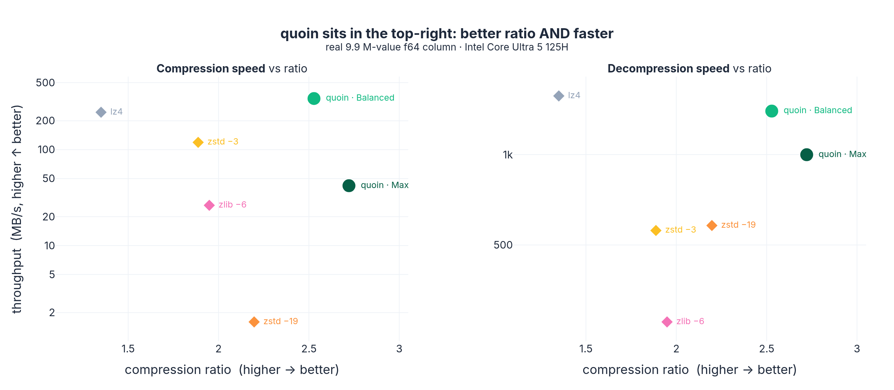

# quoin

📖 [English version](README.md)

**Lossless-компрессор для колонок чисел, учитывающий тип данных — написан на
безопасном Rust, построен на data-модели Apache Arrow.**

quoin сжимает колонки `f64`/`f32`/`i64`/`u64`/`i32`/`u32`/decimal (вместе с
битовыми масками null/validity), запуская **поблочное соревнование** лёгких,
специализированных под тип кодеков, и выдаёт наименьший результат. Поскольку он
знает *тип* колонки, он подбирает подходящий инструмент — frame-of-reference +
бит-пакинг и delta-каскады для целых, ALP / ALP-RD и численный latent-бэкенд для
чисел с плавающей точкой и decimal — вместо того чтобы трактовать каждую колонку
как непрозрачный поток байтов, как это делает обобщённый LZ-компрессор.

Результат: на реальных f64-колонках quoin обычно даёт **лучший коэффициент сжатия,
чем `zstd -19`, при этом сжимая в ~100× быстрее и распаковывая в 2–10× быстрее**,
декодируя со скоростью в несколько ГБ/с.

```rust
use quoin::{compress, decompress, Config};

let data: Vec<f64> = (0..10_000).map(|i| i as f64 * 0.5).collect();
let packed = compress(&data, Config::default());
let restored = decompress(&packed).unwrap();
assert_eq!(data, restored);
```

## Чем вдохновлён

quoin начинался как порт с нуля на безопасный Rust компрессора чисел с плавающей
точкой [`fc`](https://github.com/xtellect/fc) (Apache-2.0, © Praveen Vaddadi) и
вырос в type-aware колоночный движок. Он заимствует идеи из лучших работ по
современному колоночному сжатию:

- **[`fc`](https://github.com/xtellect/fc)** — исходный дизайн FCM/DFCM-предиктора
  + XOR-остатки, из которого вырос quoin (ID режимов до сих пор совпадают).
- **ALP** (*Adaptive Lossless floating-Point*, Afroozeh et al., CWI) — схемы
  scaled-integer и «real-double» (ALP-RD) для doubles, которые на самом деле
  являются decimal.
- **BtrBlocks / Vortex** — философия поблочного «каскада дешёвых кодировок,
  выбери победителя» и цель оставаться *быстро декодируемым*.
- **[pcodec / pco](https://github.com/mwlon/pcodec)** — вендорится (`vendor/pco`)
  как численный бэкенд верхнего уровня: latent-декомпозиция + bin-packing + ANS.
- **FastLanes** — транспонированная раскладка бит-пакинга на 1024 лейна, которая
  автовекторизуется.
- **Parquet / ClickHouse** — кодировки (`DELTA_BINARY_PACKED`, словарь, RLE) и
  поблочная модель хранения.

## Сжатие с учётом типа

Большинство байт-ориентированных компрессоров (zstd, lz4, zlib) видят колонку
doubles как плоский блоб и ищут повторяющиеся строки байтов. quoin вместо этого
опускает каждую типизированную колонку на физический **лейн** и даёт
соревноваться кодекам, подходящим под тип:

| Входной тип | Лейн | Примечание |
| --- | --- | --- |
| `f64` / `i64` / `u64` | 64-бит | **zero-copy** реинтерпретация в `u64`-лейн |
| `i32` / `u32` / `f32` | расширенный | sign/zero-extend или точное расширение, сужается обратно при декоде |
| `Decimal128` / `Decimal256` | 128 / 256-бит | отдельный decimal-контейнер (precision/scale сохраняются) |

Знание семейства (`Float` или `Int`) определяет, какие кодеки вообще попадают в
соревнование: ALP / ALP-RD / float-multiplier запускаются только на float-лейнах;
frame-of-reference и знаковый delta-каскад специализируются на целых. Для каждого
блока каждый подходящий кодек оценивается как `размер_payload + λ·стоимость_декода`,
и побеждает наименьший (`λ = 0` на верхних уровнях → чистый ratio; больший λ на
быстрых уровнях смещает выбор в сторону дешёвых для декода режимов).

### Кодеки в соревновании

20 блочных режимов плюс три варианта entropy-кодера. Главное:

- **Целые:** `ForBitpack` (frame-of-reference + FastLanes бит-пакинг),
  `DeltaBitpack` (Parquet `DELTA_BINARY_PACKED`), `OrderedDelta` (zig-zag 2-го
  порядка), `Dict` (низкая кардинальность), `Rle`.
- **Float / decimal:** `Alp`, `AlpRd`, `FloatMult` (значения — целые кратные
  `1/scale`), `Delta2` (float-экстраполяция 2-го порядка).
- **Предикторы:** `Pred` / `Pred2` / `PredRc` (FCM/DFCM хеш-предикторы с
  XOR-остатками), `DeltaDp`.
- **Обобщённые:** `Const`, `Stride`, `Xorz`, `ByteTranspose` (AoS→SoA байтовые
  плоскости), `Lz` и дословный `Raw`-базлайн, который должен побить каждый режим.
- **Численный бэкенд:** `Pco` (вендоренный pcodec) на уровнях `High`/`Max`.
- **Entropy-кодеры:** адаптивный range-кодер порядка 1 (лучший ratio), 4-канальный
  чередующийся **rANS** (намного быстрее декод) и **LZ-over-residual** каскад
  (только `Max`).

## Как это работает — алгоритмы и оптимизации

### Конвейер по блокам

Колонка разбивается на независимые **блоки**. Каждый блок сжимается сам по себе —
свой кодек-победитель, свой entropy-кодер — именно это делает кодирование и
декодирование тривиально параллельными (одна rayon-задача на блок) и даёт
random-access на гранулярности блока. Размер блока **адаптивный** (база ~256 KiB,
растущая до ~1 MiB, когда данные выглядят низкоэнтропийными, чтобы дешёвые колонки
платили меньше за фрейминг) или фиксируется через `Config.block_size` под чанки
вашего хранилища.

Фрейм на проводе — это просто `[байт режима | payload]` на блок; неизвестный режим
— жёсткая ошибка декода, никогда не молчаливая заливка нулями.

### Лейны и zero-copy опускание

Каждая типизированная колонка опускается на единственный физический **лейн**, с
которым работает движок кодеков — почти всегда `u64`-лейн:

- `f64` / `i64` / `u64` → **реинтерпретируются в `u64` без копий** (bit-cast
  слайса, без аллокаций и перестановки байтов).
- `i32` расширяется со знаком, `u32` — нулями, `f32` точно расширяется до `f64` и
  bit-cast — и сужается обратно без потерь при декоде.
- Decimal едут в отдельном 128/256-битном контейнере, сохраняющем precision/scale.

Работа в одной ширине лейна означает, что целочисленные кодеки (FoR, delta,
bit-pack) написаны один раз и применяются ко *всем* типам целочисленного семейства.
Float-числа — материал для XOR/предикторов в их сыром битовом представлении;
«float, которые на самом деле decimal» ловятся float-кодеками ниже.

### Frame-of-reference + FastLanes бит-пакинг

Рабочая лошадка для целых (`ForBitpack`). Для каждого суб-блока из 1024 значений
он вычитает минимум блока (frame of reference), считает битовую ширину диапазона
остатков и **бит-пакует** ровно в это число бит на значение. Пакинг использует
транспонированную раскладку **FastLanes** на 1024 лейна: значения чередуются по
лейнам, так что распаковка — прямолинейный, без ветвлений, автовекторизуемый
shift-and-mask без попытного ветвления. `DeltaBitpack` гоняет ту же машинерию по
дельтам 1-го порядка (Parquet `DELTA_BINARY_PACKED`) для монотонных/кластерных
колонок.

### Delta-каскады и предикторы

- **Упорядоченные дельты** (`OrderedDelta`, `Delta2`): разности первого/второго
  порядка превращают рампы и гладкие сигналы в маленькие остатки; zig-zag
  отображает знаковые дельты в маленькие беззнаковые целые перед entropy-кодом.
- **FCM / DFCM предикторы** (`Pred`, `Pred2`, `PredRc`): хеш finite-context-model
  предсказывает следующее значение по недавней истории; хранится только **XOR-остаток**
  между предсказанием и фактом, что схлопывается почти в ноль на предсказуемых
  потоках. Хеш использует аппаратную инструкцию CRC32, где доступна.
- **`DeltaDp`**: линейное предсказание 2-го порядка во float-пространстве с
  хранением точного float-остатка — и энкодер *проверяет*, что реконструкция
  бит-в-бит идентична, прежде чем выбрать его, так что «lossless» — это гарантия,
  а не надежда.

### ALP и ALP-RD для плавающей точки

Реальные doubles часто — переодетые decimal (цены, температуры, показания
сенсоров). **ALP** обнаруживает общий десятичный показатель степени, умножает
значения в целые и отдаёт их FoR+бит-пакингу — с побочным списком *исключений*
для немногих значений, которые не помещаются, так что он устойчив к выбросам.
**ALP-RD** («real double») берёт более сложный случай, разбивая каждый double на
маленький словарь старших бит плюс бит-пакованные младшие. Вместе они — причина,
по которой quoin рвёт колонки вроде `city_temperature` (8.7×), которые байтовый
LZ может лишь чуть подгрызть.

### Entropy-кодирование

Остатки с любого этапа сжимаются одним из трёх бэкендов, выбираемым по уровню:

- **Range-кодер** — бит-серийный, адаптивная байтовая модель порядка 1. Лучший
  ratio, но ~8 обновлений модели на байт, поэтому это медленный/высокоратийный
  вариант.
- **rANS** — табличный ANS, гоняемый как **четыре чередующихся канала**, так что
  независимые табличные обращения держат порты исполнения CPU занятыми, и декод
  намного быстрее range-кодера при небольшой потере ratio. Это дефолт на `Balanced`.
- **LZ-over-residual каскад** (только `Max`) — когда в остатках *всё ещё* есть
  повторы, по ним проходит LZ77 перед entropy-кодом, накладывая словарные выгоды
  поверх численной модели.

### Cost-aware селектор — «умная» часть

Соревнование — это не «попробуй всё вслепую». Несколько оптимизаций держат его
одновременно компактным *и* быстрым:

- **Скоринг, взвешенный по стоимости декода.** Каждый кандидат оценивается как
  `размер_payload + (λ · decode_weight · decoded_bytes) >> 8`. При `λ = 0` (High/Max)
  всегда побеждает наименьший выход; на быстрых уровнях ненулевой `λ` и таблица
  `decode_weight` на режим смещают выбор к дешёвым для *декода* режимам, так что
  можно купить скорость декода ценой небольшого ratio — явно, по уровням.
- **Ранний выход для несжимаемых блоков.** Перед запуском пула блок, который уже
  высоко-различимый с диапазонами значений *и* дельт полной ширины, распознаётся
  как безнадёжный и сразу выдаётся как `Raw` — без впустую потраченных проб кодеков.
- **Пул, ограниченный уровнем.** Дорогие, невекторизуемые режимы (последовательные
  предикторы, LZ-каскад, pco-бэкенд) попадают в соревнование только на уровнях,
  которые их запрашивают, так что `Fastest`/`Balanced` остаются по-настоящему
  быстрыми.
- **Опциональный сэмплирующий селектор** (`Selection::Sample`): вместо полного
  кодирования каждого кандидата он может оценивать их на репрезентативном сэмпле
  блока и фиксировать только победителя — обменивая малую долю ratio на большое
  ускорение кодирования.

### Численный бэкенд pco

На `High`/`Max` вендоренный **pcodec** (режим `Pco`) присоединяется к соревнованию
для численных колонок: он декомпозирует значения в latent-потоки, bin-пакует их и
ANS-кодирует результат — часто это победитель по ratio на гладких численных данных.
Три его векторизуемых листа декода скомпилированы через `multiversion` (см. ниже),
так что он декодирует быстро даже на стоковой сборке.

## Интеграция с Apache Arrow и преимущества над Parquet

С `--features arrow` quoin сжимает и восстанавливает Arrow-массивы напрямую:

```rust
use quoin::arrow::{compress_array, decompress_array};

let packed = compress_array(&array, Config::default())?;   // &dyn Array -> Vec<u8>
let restored = decompress_array(&packed)?;                  // -> ArrayRef
```

Он принимает массивы `Float64/32`, `Int64/32`, `UInt64/32` и `Decimal128/256`,
читает значения **zero-copy** из Arrow-буферов и round-trip-ит Arrow validity
(null) bitmap — это та же LSB-first раскладка, что quoin использует внутри, так
что на границе нет транскодирования. Типизированный, Arrow-native **C ABI**
(`capi/`) открывает тот же путь не-Rust вызывающим, декодируя прямо в
предоставленный вызывающим буфер (безопасно по выравниванию, с zero-copy
fast-path, когда вход выровнен).

Как это сравнивается с **Parquet** в роли слоя сжатия:

- **Специализация по типу, а не обобщённо.** Тяжёлая работа Parquet — обычно
  обобщённый zstd/snappy-проход по байтовым страницам; поблочное соревнование
  кодеков quoin выбирается *по типу*, так что гладкие/периодические/decimal
  колонки сжимаются лучше (см. бенчмарки).
- **Намного быстрее декод.** quoin декодирует несколько ГБ/с — он соревнуется на
  *Pareto-фронте декода*, а не только по ratio.
- **Гранулярность блока и настраиваемость.** Фиксированный `Config.block_size`
  выравнивает блоки сжатия под чанки вашего хранилища для независимого,
  параллельного, random-access декода — без накладных расходов row-group/page-header
  Parquet.
- **Остаётся в модели Arrow.** Никаких метаданных row-group, конверта схемы или
  церемоний файлового формата — это кодек колоночного буфера, который можно
  встроить в Arrow-native хранилище.

## Бенчмарки

Замерено на Intel Core Ultra 5 125H, стабильный Rust release-билд (без
`target-cpu=native`), на реальных `f64`-колонках из **бенчмарк-корпуса ALP**.
Ratio = оригинал ÷ сжатое (больше — лучше); пропускная способность в МБ/с
*несжатых* данных (медиана из 3 прогонов). Базлайны (`lz4`, `zlib`, `zstd`) —
однопоточные bulk-API; quoin использует свой дефолтный block-parallel (rayon) путь.
Воспроизвести:

```bash
cargo run --release --example bench_readme \
    --features bench-zstd,bench-lz4,bench-deflate > bench.csv
```

### Компромисс ratio ⇄ скорость

Весь смысл type-aware кодека — уйти от обычного «выбирай ratio *или* скорость».
Каждый кодек ниже — это одна точка; **верхний правый угол — лучший** (высокий
ratio, высокая пропускная способность). quoin оказывается вверху-справа на *обеих*
осях — `zstd -19` догоняет его по ratio лишь ценой обвала сжатия до 1.6 МБ/с, а
`lz4` быстр только при ratio, который почти не сжимает.



Числа за графиком (полная колонка `arade4`, 9.9 млн значений; те же данные,
усечённые до меньших размеров в правых колонках — показывают, что ratio
стабилен по размеру):

| кодек | ratio | сжатие МБ/с | распаковка МБ/с | ratio @100 K | ratio @1 M |
| --- | ---: | ---: | ---: | ---: | ---: |
| **quoin (Balanced)** | **2.53** | 341 | **1396** | 2.55 | 2.52 |
| quoin (High) | 2.72 | 99 | 994 | 2.72 | 2.71 |
| **quoin (Max)** | **2.72** | 42 | 999 | 2.72 | 2.71 |
| lz4 | 1.35 | 246 | 1569 | 1.32 | 1.34 |
| zlib -6 | 1.95 | 26 | 277 | 1.91 | 1.94 |
| zstd -3 | 1.89 | 119 | 559 | 1.86 | 1.88 |
| zstd -19 | 2.20 | **1.6** | 581 | 2.17 | 2.19 |

quoin-Balanced бьёт ratio `zstd -19` (2.53 против 2.20), при этом сжимая
**~210× быстрее** и распаковывая **~2.4× быстрее**; quoin-Max доводит ratio до 2.72.

### Ratio по реальным колонкам

На корпусе ALP quoin-Max берёт лучший ratio на 6 из 8 колонок (слева направо
отсортированы по ratio quoin):


| датасет | n | lz4 | zlib -6 | zstd -3 | zstd -19 | quoin-Bal | quoin-Max |
| --- | ---: | ---: | ---: | ---: | ---: | ---: | ---: |
| air_sensor | 8 664 | 1.00 | 1.13 | 1.07 | 1.19 | 1.19 | **1.38** |
| bird_migration | 17 964 | 2.13 | 3.13 | 3.04 | 3.37 | 5.18 | **6.03** |
| basel_wind | 123 480 | 2.29 | 3.74 | 4.38 | 5.00 | 2.10 | **5.52** |
| poi_lat | 424 205 | 1.01 | 1.14 | 1.31 | **1.75** | 1.14 | 1.20 |
| city_temperature | 2 000 000 | 2.48 | 4.43 | 4.05 | 6.29 | 7.34 | **8.68** |
| food_prices | 2 000 000 | 2.55 | 4.08 | 3.87 | **4.93** | 3.87 | 4.83 |
| neon_dew_point | 2 000 000 | 1.93 | 3.15 | 3.10 | 3.72 | 5.72 | **6.41** |
| bitcoin_tx | 231 031 | 1.23 | 1.73 | 1.66 | 1.77 | 2.11 | **2.34** |

quoin-Max выигрывает ratio на 6 из 8 реальных колонок (часто с большим отрывом —
`city_temperature` 8.68× против `zstd -19` 6.29×) и обменивается ударами с
`zstd -19` на остальных двух (`poi_lat`, `food_prices`), всё это при гораздо более
быстром декоде. Там, где колонка по-настоящему высокоэнтропийна (`poi_lat`,
гео-координаты), обобщённый LZ-этап всё ещё имеет преимущество — quoin честен на
этот счёт.

## Производительность: SIMD, multiversion, rayon

- **Параллелизм по блокам через rayon** (дефолтная фича `parallel`). Блоки
  независимы, так что кодирование и декодирование расходятся по ядрам через rayon —
  `Config.threads` ограничивает пул, `None` использует глобальный. Именно поэтому
  пропускная способность quoin масштабируется с размером колонки и почему его декод
  бьёт однопоточные zstd/zlib выше.
- **Per-CPU клоны через `multiversion`.** Лейн-операции (delta, transpose,
  битовые плоскости) и три векторизуемых листа декода вендоренного pco-бэкенда
  (offset bit-unpack, latent reconstruct, center-toggle) компилируются в варианты
  AVX2+BMI2 / AVX2 / SSE4.2 / NEON, выбираемые в рантайме. **Стоковая сборка
  получает векторизованный fast-path без `-C target-cpu=native`** *и* при этом
  работает на старых CPU через скалярный базовый клон — на профилированном декоде
  `sensor_f64` это вернуло **+27%** против non-native сборки pco, обогнав даже
  `native`-сборку.
- **Сырые интринсики `core::arch`** для горячих, нерегулярных ядер (хеш
  FCM-предиктора использует `_mm_crc32_u64` с рантайм-определением фич); всё
  остальное — обычный скалярный Rust, отданный автовекторизатору LLVM.

В отличие от C-оригинала (только x86, UB на неизвестном входе), **у каждого
SIMD-ядра есть бит-в-бит скалярный фолбэк**, так что поток декодируется идентично
независимо от CPU, а неизвестные режимы блока — жёсткая ошибка, а не молчаливая
заливка нулями.

## Уровни сжатия

Пятиступенчатая ручка скорость/ratio (лестница классов стоимости декода):

| Уровень | Пул | Декод | Ratio |
| --- | --- | --- | --- |
| **Fastest** | RAW/CONST/STRIDE + FoR/delta бит-пак | random-access, быстрейший | минимальный |
| **Fast** | + XORZ / ALP / dict / RLE | random-access | умеренный |
| **Balanced** | + rANS-entropy на векторизуемых режимах | без рекурсии, быстро | хороший |
| **High** | + последовательные предикторы + range-кодер + **pco** | медленнее | почти лучший |
| **Max** (дефолт) | + LZ-over-residual каскад (`λ = 0`) | медленнейший | лучший |

Размер блока адаптивен по умолчанию или фиксируется через `Config.block_size` под
выравнивание с чанками хранилища и random-access.

## Сборка

```bash
cargo build --release
cargo test            # round-trip + проверки ratio по синтетическим датасетам
cargo bench           # микро-бенчмарки уровня ядер (criterion)
```

Стабильный Rust, edition 2024, без nightly-фич. Опциональные фичи: `arrow`,
`parallel` (дефолт) и базлайны `bench-*`.

Статус, roadmap и заметки по дизайну — в [`ROADMAP.md`](ROADMAP.md),
[`docs/BENCHMARKS.md`](docs/BENCHMARKS.md) и [`docs/LANDSCAPE.md`](docs/LANDSCAPE.md).

## Лицензия

Apache-2.0, как и у вышестоящего проекта `fc`.
