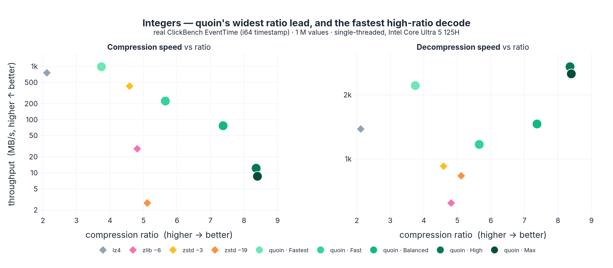
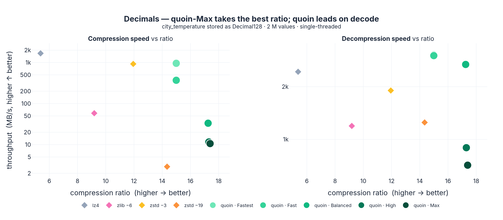
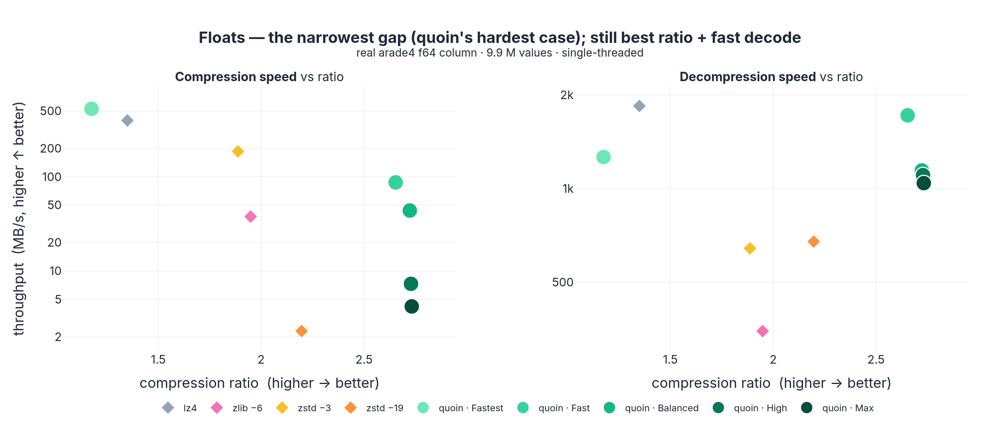
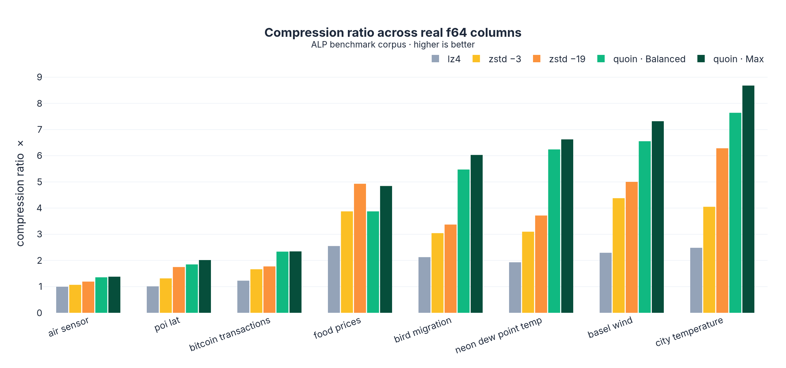
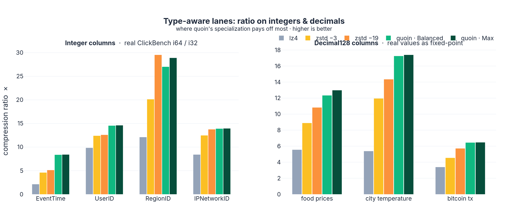

# quoin

📖 [English version](README.md)

**Lossless-компрессор для колонок чисел, учитывающий тип данных — написан в
основном на безопасном Rust, построен на data-модели Apache Arrow.**

(Единственный `unsafe` в собственном коде quoin — два маленьких задокументированных
блока: аппаратный CRC32C-интринсик в `hash.rs` и снятие проверки границ в горячем
цикле range-кодера; у каждого SIMD-ядра есть бит-в-бит безопасный фолбэк. Вендоренный
бэкенд `pco` использует больше внутреннего `unsafe` для быстрого bit-reader.)

quoin сжимает колонки `f64`/`f32`/`i64`/`u64`/`i32`/`u32`/decimal (вместе с
битовыми масками null/validity), запуская **поблочное соревнование** лёгких,
специализированных под тип кодеков, и выдаёт наименьший результат. Поскольку он
знает *тип* колонки, он подбирает подходящий инструмент — frame-of-reference +
бит-пакинг и delta-каскады для целых, ALP / ALP-RD и численный latent-бэкенд для
чисел с плавающей точкой и decimal — вместо того чтобы трактовать каждую колонку
как непрозрачный поток байтов, как это делает обобщённый LZ-компрессор.

Результат (однопоточно, см. [Бенчмарки](#бенчмарки)): на реальных f64-колонках
quoin обычно даёт **лучший коэффициент сжатия, чем `zstd -19`, при этом сжимая
в ~25× быстрее и распаковывая в 2–5× быстрее, чем zstd/zlib**. Его выигрыш — это
ratio + скорость декода; кодирование — осознанный компромисс уровня (поблочный
поиск кодека CPU-тяжёлый, поэтому быстрые LZ-кодеки обгоняют его по энкоду при
куда худшем ratio).

```rust
use quoin::{compress, decompress, Config};

let data: Vec<f64> = (0..10_000).map(|i| i as f64 * 0.5).collect();
let packed = compress(&data, Config::default());
let restored = decompress(&packed).unwrap();
assert_eq!(data, restored);
```

## Чем вдохновлён

quoin начинался как порт с нуля на безопасный Rust компрессора чисел с плавающей
точкой [`fc`](https://github.com/xtellect/fc) (Apache-2.0, © Praveen Vaddadi) и
вырос в type-aware колоночный движок. Он заимствует идеи из лучших работ по
современному колоночному сжатию:

- **[`fc`](https://github.com/xtellect/fc)** — исходный дизайн FCM/DFCM-предиктора
  + XOR-остатки, из которого вырос quoin (ID режимов до сих пор совпадают).
- **ALP** (*Adaptive Lossless floating-Point*, Afroozeh et al., CWI) — схемы
  scaled-integer и «real-double» (ALP-RD) для doubles, которые на самом деле
  являются decimal.
- **BtrBlocks / Vortex** — философия поблочного «каскада дешёвых кодировок,
  выбери победителя» и цель оставаться *быстро декодируемым*.
- **[pcodec / pco](https://github.com/mwlon/pcodec)** — вендорится (`vendor/quoin-pco`)
  как численный бэкенд верхнего уровня: latent-декомпозиция + bin-packing + ANS.
- **FastLanes** — транспонированная раскладка бит-пакинга на 1024 лейна, которая
  автовекторизуется.
- **Parquet / ClickHouse** — кодировки (`DELTA_BINARY_PACKED`, словарь, RLE) и
  поблочная модель хранения.

## Сжатие с учётом типа

Большинство байт-ориентированных компрессоров (zstd, lz4, zlib) видят колонку
doubles как плоский блоб и ищут повторяющиеся строки байтов. quoin вместо этого
опускает каждую типизированную колонку на физический **лейн** и даёт
соревноваться кодекам, подходящим под тип:

| Входной тип | Лейн | Примечание |
| --- | --- | --- |
| `f64` / `i64` / `u64` | 64-бит | **zero-copy** реинтерпретация в `u64`-лейн |
| `i32` / `u32` / `f32` | расширенный | sign/zero-extend или точное расширение, сужается обратно при декоде |
| `Decimal128` / `Decimal256` | 128 / 256-бит | отдельный decimal-контейнер (precision/scale сохраняются) |

Знание семейства (`Float` или `Int`) определяет, какие кодеки вообще попадают в
соревнование: ALP / ALP-RD / float-multiplier запускаются только на float-лейнах;
frame-of-reference и знаковый delta-каскад специализируются на целых. Для каждого
блока каждый подходящий кодек оценивается как `размер_payload + λ·стоимость_декода`,
и побеждает наименьший (`λ = 0` на верхних уровнях → чистый ratio; больший λ на
быстрых уровнях смещает выбор в сторону дешёвых для декода режимов).

### Кодеки в соревновании

21 блочный режим плюс три варианта entropy-кодера. Главное:

- **Целые:** `ForBitpack` (frame-of-reference + FastLanes бит-пакинг),
  `DeltaBitpack` (Parquet `DELTA_BINARY_PACKED`), `OrderedDelta` (zig-zag 2-го
  порядка), `Dict` (низкая кардинальность), `DictShared` (**общий словарь
  значений на всю колонку**, хранится один раз на поток — блоки несут только
  коды, поэтому значения, повторяющиеся *между* блоками, оплачиваются
  однажды), `Rle`.
- **Float / decimal:** `Alp`, `AlpRd`, `FloatMult` (значения — целые кратные
  `1/scale`), `Delta2` (float-экстраполяция 2-го порядка).
- **Предикторы:** `Pred` / `Pred2` / `PredRc` (FCM/DFCM хеш-предикторы с
  XOR-остатками), `DeltaDp`.
- **Обобщённые:** `Const`, `Stride`, `Xorz`, `ByteTranspose` (AoS→SoA байтовые
  плоскости), `Lz` и дословный `Raw`-базлайн, который должен побить каждый режим.
- **Численный бэкенд:** `Pco` (вендоренный pcodec) на уровнях `High`/`Max`.
- **Entropy-кодеры:** адаптивный range-кодер порядка 1 (лучший ratio), 4-канальный
  чередующийся **rANS** (намного быстрее декод) и **LZ-over-residual** каскад
  (только `Max`).

## Как это работает

quoin опускает каждую типизированную колонку на единственный `u64`-лейн, режет её
на независимые **блоки** и запускает **поблочное соревнование**: каждый подходящий
кодек кодирует блок, побеждает наименьший — по метрике `размер + λ·стоимость_декода`.
Пул специализирован по типу (frame-of-reference + бит-пакинг и delta-каскады для
целых; ALP / ALP-RD / FLOAT_MULT и численный latent-бэкенд для float и decimal);
три entropy-кодера (4-канальный **rANS**, order-1 **range-кодер**,
**LZ-over-residual каскад**) и order-1 оценщик-гейт держат поиск дешёвым. Ручка
уровня регулирует, сколько из этого участвует.

**Полный внутренний дизайн — карта модулей, конвейер кодирования/декодирования,
список кодеков, entropy- и каскадный слой, формат потока, параллелизм и
SIMD-стратегия — в [docs/ARCHITECTURE.md](docs/ARCHITECTURE.md).**

## Интеграция с Apache Arrow и преимущества над Parquet

С `--features arrow` quoin сжимает и восстанавливает Arrow-массивы напрямую:

```rust
use quoin::arrow::{compress_array, decompress_array};

let packed = compress_array(&array, Config::default())?;   // &dyn Array -> Vec<u8>
let restored = decompress_array(&packed)?;                  // -> ArrayRef
```

Он принимает массивы `Float64/32`, `Int64/32`, `UInt64/32` и `Decimal128/256`,
читает значения **zero-copy** из Arrow-буферов и round-trip-ит Arrow validity
(null) bitmap — это та же LSB-first раскладка, что quoin использует внутри, так
что на границе нет транскодирования. Типизированный, Arrow-native **C ABI**
(`capi/`) открывает тот же путь не-Rust вызывающим, декодируя прямо в
предоставленный вызывающим буфер (безопасно по выравниванию, с zero-copy
fast-path, когда вход выровнен).

Как это сравнивается с **Parquet** в роли слоя сжатия:

- **Специализация по типу, а не обобщённо.** Тяжёлая работа Parquet — обычно
  обобщённый zstd/snappy-проход по байтовым страницам; поблочное соревнование
  кодеков quoin выбирается *по типу*, так что гладкие/периодические/decimal
  колонки сжимаются лучше (см. бенчмарки).
- **Намного быстрее декод.** quoin декодирует несколько ГБ/с — он соревнуется на
  *Pareto-фронте декода*, а не только по ratio.
- **Гранулярность блока и настраиваемость.** Фиксированный `Config.block_size`
  выравнивает блоки сжатия под чанки вашего хранилища для независимого,
  параллельного, random-access декода — без накладных расходов row-group/page-header
  Parquet.
- **Остаётся в модели Arrow.** Никаких метаданных row-group, конверта схемы или
  церемоний файлового формата — это кодек колоночного буфера, который можно
  встроить в Arrow-native хранилище.

## Бенчмарки

Замерено на Intel Core Ultra 5 125H, стабильный Rust release-билд (без
`target-cpu=native`), **однопоточно** — quoin собран **без фичи `parallel`** (без
rayon) и закреплён на одном P-ядре (`taskset -c 0`), чтобы мерить apples-to-apples
с однопоточными bulk-API `lz4`/`zlib`/`zstd`. (Дефолтный билд quoin *block-parallel*;
просто нечестно ставить это на одну ось с однопоточным базлайном.) Целые колонки —
реальные `i64`/`i32` из датасета ClickBench `hits`; float-колонки — **корпус ALP**;
decimal-колонки — реальные f64-значения как fixed-point `Decimal128`. Ratio =
оригинал ÷ сжатое (больше — лучше); пропускная способность в МБ/с *несжатых* данных
(медиана из 3 прогонов). Воспроизвести:

```bash
# f64 (корпус ALP) — однопоточно, без rayon
taskset -c 0 cargo run --release --no-default-features --example bench_readme \
    --features bench-zstd,bench-lz4,bench-deflate > bench.csv
# целые (ClickBench parquet) + Decimal128
PARQUET_FILE=datasets/parquet/clickbench_hits_0.parquet \
taskset -c 0 cargo run --release --no-default-features --example bench_typed \
    --features bench-parquet,bench-zstd,bench-lz4,bench-deflate > typed.csv
```

### Компромисс ratio ⇄ скорость, по типам данных

Все числа **однопоточные** (одно P-ядро, без rayon) — quoin и однопоточные
`lz4`/`zlib`/`zstd` меряются apples-to-apples. Каждый кодек — одна точка; **верхний
правый угол — лучший** (высокий ratio, высокая пропускная способность), слева
скорость сжатия, справа — распаковки. Графики упорядочены по отрыву quoin по ratio:
**целые и decimal сверху** (там специализированные лейны уходят дальше всего
вперёд), **float снизу** (самый трудный случай для quoin).

Два честных вывода для всех трёх типов:

- **Декод — это фронтир quoin.** quoin держит лучший ratio *и* скорость декода на
  уровне базлайнов или выше — уровни quoin образуют верхне-правую кромку панели
  распаковки (Fastest = быстрейший декод, Max = высший ratio, оба всё ещё быстрые).
- **Кодирование — осознанный компромисс.** Поблочный *поиск* кодека стоит CPU,
  поэтому высокоратийные уровни quoin кодируют медленнее быстрых `lz4`/`zstd -3`
  (которые покупают эту скорость куда худшим ratio). quoin-Balanced всё равно
  кодирует в **~25× быстрее `zstd -19` при лучшем ratio** (и даже исчерпывающий
  Max — ~2× быстрее), а ручка уровня (Fastest→Max) позволяет явно менять
  скорость кодирования на ratio.

**Целые** — quoin-Max достаёт 8.4× (против 5.1× у `zstd -19`) и декодирует быстрее
любого базлайна; на кодировании медленнее `zstd -3`, но всё ещё ~3× быстрее
`zstd -19` при куда большем ratio:



**Decimal** — quoin-Max берёт лучший ratio (17.4× против 14.3× у `zstd -19`);
quoin-Balanced даёт 13.4× при **36 МБ/с** кодирования против 14.3× у `zstd -19` при
**3 МБ/с** (~12× быстрее), а уровни quoin владеют панелью декода:



**Float** — самый узкий отрыв (биты мантиссы высокоэнтропийны): quoin-Balanced бьёт
ratio `zstd -19` (2.53 против 2.20) и декодирует **~2.7× быстрее**; здесь быстрые
`lz4`/`zstd -3` кодируют быстрее (при ratio 1.35–1.89×), так что именно на float
стоимость поиска кодека у quoin виднее всего:



Числа за float-графиком (полная колонка `arade4`, 9.9 млн значений; правые
колонки усекают те же данные — показывают, что ratio стабилен по размеру):

| кодек | ratio | сжатие МБ/с | распаковка МБ/с | ratio @100 K | ratio @1 M |
| --- | ---: | ---: | ---: | ---: | ---: |
| quoin (Fastest) | 1.17 | **619** | 1330 | 1.18 | 1.17 |
| quoin (Fast) | 2.52 | 109 | 1830 | 2.47 | 2.51 |
| **quoin (Balanced)** | **2.53** | 52 | 1854 | 2.47 | 2.51 |
| quoin (High) | 2.73 | 8.1 | 1153 | 2.72 | 2.73 |
| **quoin (Max)** | **2.73** | 4.6 | 1100 | 2.72 | 2.73 |
| lz4 | 1.35 | 418 | **1933** | 1.32 | 1.34 |
| zlib -6 | 1.95 | 41 | 375 | 1.91 | 1.94 |
| zstd -3 | 1.89 | 212 | 770 | 1.86 | 1.88 |
| zstd -19 | 2.20 | 2.2 | 691 | 2.17 | 2.19 |

quoin-Balanced бьёт ratio `zstd -19` (2.53 против 2.20), декодируя **~2.7× быстрее**;
quoin-Max доводит ratio до 2.73.

### Ratio по реальным колонкам

На корпусе ALP quoin-Max берёт лучший ratio на 7 из 8 колонок (слева направо
отсортированы по ratio quoin):



| датасет | n | lz4 | zlib -6 | zstd -3 | zstd -19 | quoin-Bal | quoin-Max |
| --- | ---: | ---: | ---: | ---: | ---: | ---: | ---: |
| air_sensor | 8 664 | 1.00 | 1.13 | 1.07 | 1.19 | 1.38 | **1.38** |
| bird_migration | 17 964 | 2.13 | 3.13 | 3.04 | 3.37 | 5.47 | **6.03** |
| basel_wind | 123 480 | 2.29 | 3.74 | 4.38 | 5.00 | 6.46 | **7.29** |
| poi_lat | 424 205 | 1.01 | 1.14 | 1.31 | 1.75 | 1.82 | **2.00** |
| city_temperature | 2 000 000 | 2.48 | 4.43 | 4.05 | 6.29 | 7.01 | **8.68** |
| food_prices | 2 000 000 | 2.55 | 4.08 | 3.87 | **4.93** | 3.89 | 4.84 |
| neon_dew_point | 2 000 000 | 1.93 | 3.15 | 3.10 | 3.72 | 6.03 | **6.62** |
| bitcoin_tx | 231 031 | 1.23 | 1.73 | 1.66 | 1.77 | 2.34 | **2.35** |

quoin-Max выигрывает ratio на 7 из 8 реальных колонок (часто с большим отрывом —
`city_temperature` 8.68× против `zstd -19` 6.29×). `poi_lat` — повторяющиеся
гео-координаты, раньше единственное поражение quoin здесь — перевернулась в
победу (2.00× против 1.75×) благодаря **общему словарю значений на всю колонку**
(`DictShared`), который хранит различные значения один раз на поток, а не в
каждом блоке. За `zstd -19` остаётся небольшое преимущество на одной колонке
(`food_prices`, 4.93 против 4.84) — и всё это при гораздо более быстром декоде
quoin.

### Целые и decimal — где type-awareness сильнее всего

f64 — это на самом деле *самый трудный* случай для quoin (биты мантиссы
высокоэнтропийны). На **целых и decimal** специализированные лейны —
frame-of-reference + бит-пакинг, delta-каскады, decimal-контейнер — уходят далеко
вперёд от байт-слепых компрессоров. Целые колонки — реальные `i64`/`i32` из
датасета ClickBench `hits`; decimal-колонки — реальные f64-значения, сохранённые
как fixed-point `Decimal128` (случай «храним цены/измерения как DECIMAL, а не
DOUBLE»). Базлайны сжимают сырые little-endian байты значений.



| колонка | тип | lz4 | zstd -3 | zstd -19 | quoin-Bal | quoin-Max |
| --- | --- | ---: | ---: | ---: | ---: | ---: |
| EventTime (таймстемп) | i64 | 2.1 | 4.6 | 5.1 | 7.4 | **8.4** |
| UserID (кластерный) | i64 | 9.8 | 12.4 | 12.6 | 10.9 | **14.6** |
| WatchID (случайный) | i64 | 1.0 | 1.0 | 1.0 | 1.0 | 1.0 |
| CounterID (низкая кард.) | i32 | 254 | 9 950 | 10 444 | 780 | **19 231** |
| RegionID | i32 | 12.1 | 20.1 | **29.5** | 26.7 | 28.7 |
| IPNetworkID | i32 | 8.4 | 12.5 | 13.8 | 13.9 | **13.9** |
| food_prices | dec128 | 5.6 | 8.9 | 10.8 | 12.0 | **12.9** |
| city_temperature | dec128 | 5.4 | 12.0 | 14.3 | 13.4 | **17.4** |
| bitcoin_tx | dec128 | 3.4 | 4.5 | 5.7 | 6.4 | **6.5** |

quoin-Max берёт лучший ratio на **каждой decimal-колонке** и на большинстве целых;
на по-настоящему случайных ID (`WatchID`) все упираются в ~1.0× (это не сжимается
ничем), а `zstd -19` чуть обходит его на одной структурной i32 (`RegionID`).

Скорость декода (МБ/с, однопоточно) — ось, где quoin конкурирует даже с lz4:

| колонка | тип | lz4 | quoin-Fastest | quoin-Bal | quoin-Max |
| --- | --- | ---: | ---: | ---: | ---: |
| EventTime | i64 | 1384 | 2211 | 1460 | **2510** |
| UserID | i64 | 1695 | 3078 | **5054** | 2791 |
| RegionID | i32 | **2377** | 2157 | 1330 | 1246 |
| city_temperature | dec128 | **5423** | 3545 | 1878 | 876 |
| bitcoin_tx | dec128 | 4710 | **5572** | 4391 | 4129 |

На delta-дружелюбных целых (`EventTime`, `UserID`) quoin-Max декодирует **быстрее
lz4**, сжимая в 4–8× лучше. На чистом bitpack `RegionID` и самых гладких decimal
memcpy-декод lz4 быстрее — но при куда худшем ratio lz4 (`RegionID` 12× против 29× у
quoin), и quoin-Fastest остаётся в том же классе декода. Кодирование — осознанный
компромисс: поиск кодека CPU-тяжёлый, поэтому быстрые LZ-базлайны кодируют быстрее
(при куда меньшем ratio), а quoin всё равно обгоняет `zstd -19`.

## Производительность: SIMD, multiversion, rayon

- **Параллелизм по блокам через rayon** (дефолтная фича `parallel`; без неё
  собирается полностью однопоточно).
- **Per-CPU клоны через `multiversion`** для лейн-операций и листов декода pco —
  векторизованный путь выбирается в рантайме, так что **стоковая сборка получает
  его без `-C target-cpu=native`** и работает на старых CPU через скалярный клон
  (вернуло **+27%** на профилированном декоде `sensor_f64`).
- **Сырые интринсики `core::arch`** для горячих нерегулярных ядер (хеш FCM
  использует `_mm_crc32_u64` с рантайм-определением); всё остальное автовекторизуется.

У каждого SIMD-ядра есть **бит-в-бит скалярный фолбэк** — поток декодируется
идентично независимо от CPU. Детали в [docs/ARCHITECTURE.md](docs/ARCHITECTURE.md#12-simd-strategy).

## Уровни сжатия

Пятиступенчатая ручка скорость/ratio (лестница классов стоимости декода):

| Уровень | Пул | Декод | Ratio |
| --- | --- | --- | --- |
| **Fastest** | RAW/CONST/STRIDE + FoR/delta бит-пак | random-access, быстрейший | минимальный |
| **Fast** | + XORZ / ALP / ALP-RD / dict / RLE | random-access | умеренный |
| **Balanced** | + rANS-entropy + **pco** (быстрый декод) | без рекурсии, быстро | хороший |
| **High** | + последовательные предикторы + range-кодер | медленнее | почти лучший |
| **Max** (дефолт) | + LZ-over-residual каскад (`λ = 0`) | медленнейший | лучший |

Размер блока адаптивен по умолчанию или фиксируется через `Config.block_size` под
выравнивание с чанками хранилища и random-access.

## Документация

| Документ | Что внутри |
| --- | --- |
| [docs/ARCHITECTURE.md](docs/ARCHITECTURE.md) | Как устроен движок изнутри — карта модулей, конвейер кодирования/декодирования, кодеки, entropy и каскады, формат потока, параллелизм, SIMD. |
| [docs/BENCHMARKS.md](docs/BENCHMARKS.md) | Полные числа бенчмарков и методология. |
| [ROADMAP.md](ROADMAP.md) | Что сделано, что дальше, известные пробелы. |
| [docs/TYPES.md](docs/TYPES.md) | Система типов и маппинг на Arrow. |
| [docs/LANDSCAPE.md](docs/LANDSCAPE.md) | Конкурентный контекст (Vortex, BtrBlocks, FastLanes, ALP, pco). |
| [docs/PERFORMANCE.md](docs/PERFORMANCE.md) | Заметки по производительности и обоснование ручки скорость/ratio. |

## Сборка

```bash
cargo build --release
cargo test            # round-trip + проверки ratio по синтетическим датасетам
cargo bench           # микро-бенчмарки уровня ядер (criterion)
```

Стабильный Rust, edition 2024, без nightly-фич. Опциональные фичи: `arrow`,
`parallel` (дефолт) и базлайны `bench-*`.

Статус, roadmap и заметки по дизайну — в [`ROADMAP.md`](ROADMAP.md),
[`docs/BENCHMARKS.md`](docs/BENCHMARKS.md) и [`docs/LANDSCAPE.md`](docs/LANDSCAPE.md).

## Лицензия

Apache-2.0, как и у вышестоящего проекта `fc`.
